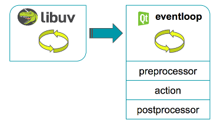

# QttpServer 1.0.0 beta

See Current Release: [QttpServer v0.1.0](https://github.com/supamii/QttpServer/tree/QTTPv0.1.0)

<b>QttpServer</b> is a fork from [node.native](https://github.com/d5/node.native) with some additional contributions from [tojocky](https://github.com/tojocky/node.native).

Check out the [examples](examples/README.md) and samples to get started with your RESTful API server!



## Features

* NodeJS's [libuv](https://github.com/libuv/libuv) integrated with Qt
* NodeJS's [http-parser](https://github.com/nodejs/http-parser)
* URL routing e.g. /v1/your/api/path
* Pre & Post processing hooks and chaining
* Submodules ready to support [MongoDb](https://github.com/mongodb/mongo-cxx-driver), [Redis](https://github.com/uglide/qredisclient)
* Logging support
* Swagger-UI support
* Very basic support for HTML files (html, js, css, txt, etc)

## Example 1: 
Using a raw std::function based callback

```c++
#include <httpserver.h>

using namespace std;
using namespace qttp;
using namespace native::http;

int main(int argc, char** argv)
{
  QCoreApplication app(argc, argv);

  // Always initialize in the main thread.
  HttpServer* httpSvr = HttpServer::getInstance();
  httpSvr->initialize();

  // Associate this call-back with the action named, "test"
  httpSvr->addAction("test", [](HttpData& data) {
    // Form the JSON content and let the framework handle the rest.
    QJsonObject& json = data.getResponse().getJson();
    json["response"] = "Test C++ FTW";
  });

  // Bind the http method, action name, and the url route together.
  httpSvr->registerRoute("get", "test", "/test");
  httpSvr->registerRoute("get", "test", "/test2");

  // Libuv runs in its own thread.
  httpSvr->startServer();

  // Qt takes the main thread per the usual.
  return app.exec();
}
```

## Example 2: 
Using the action interface

```c++
#include <httpserver.h>

using namespace std;
using namespace qttp;
using namespace native::http;

class Sample : public Action {
  void onAction(HttpData& data) {
    QJsonObject& json = data.getResponse().getJson();
    json["response"] = "Sample C++ FTW";
  }
  const const char* getName() const { return "sample"; }
};

int main(int argc, char** argv)
{
  QCoreApplication app(argc, argv);

  // Always initialize in the main thread.
  HttpServer* httpSvr = HttpServer::getInstance();
  httpSvr->initialize();
  
  // Adds the action interface via template method.
  httpSvr->addAction<Sample>();

  // Based on class definition below, we bind the the http method, action name, 
  // and the url route.
  httpSvr->registerRoute("get", "sample", "/sample");
  httpSvr->registerRoute("post", "sample", "/sampleAgain");

  // Libuv runs in its own thread.
  httpSvr->startServer();

  // Qt takes the main thread per the usual.
  return app.exec();
}
```

## Getting started on Mac & Linux

### Prerequisites

1. [git](http://git-scm.com/)
2. [python 2.x](https://www.python.org/)
3. [qt installer](http://www.qt.io/download/) or [build](http://doc.qt.io/qt-5/linux-building.html) from [source](http://download.qt.io/official_releases/qt/5.5/5.5.1/single/)

   ```bash
   # Building from source is a breeze - works well for Ubuntu 12 & 14 LTS
   sudo apt-get install libssl-dev
   wget http://download.qt.io/official_releases/qt/5.5/5.5.1/single/qt-everywhere-opensource-src-5.5.1.tar.gz
   tar -xvf qt-everywhere-opensource-src-5.5.1.tar.tz
   cd qt-everywhere-opensource-src-5.5.1
   ./configure -nomake examples -opensource -skip qtwebkit -skip qtwebchannel -skip qtquick1 -skip qtdeclarative -openssl-linked
   make
   sudo make install
   ```
   
4. perl

### Build

```bash
git clone https://github.com/supamii/QttpServer.git
cd QttpServer
```

Git submodules/dependencies automatically pulls in mongodb-drivers, boost, libuv, http-parser
```bash
git submodule update --init
```

Generate build files and compile to ./build/out/ folder
```bash
./build.py
make -C build/out
```

Generate and build or launch `qttp.pro` with Qt Creator
```bash
qmake CONFIG+=debug qttp.pro
make
```

If you want to run a quick sample application:
```bash
qmake CONFIG+=debug CONFIG+=SAMPLEAPP qttp.pro
make
./qttpserver
```

If you want to compile a static library:
```bash
qmake CONFIG+=debug CONFIG+=QTTP_LIBRARY qttp.pro
```

If you want to compile a shared library:
```bash
qmake CONFIG+=debug CONFIG+=QTTP_LIBRARY CONFIG+=QTTP_EXPORT qttp.pro
```

## Optional components

##### Build Redis client

Pretty straight forward stuff here - just be mindful of the extra environment variable set to DESTDIR:

```bash
cd lib/qredisclient
git submodule update --init
qmake CONFIG+=debug DESTDIR=. qredisclient.pro
make
```

##### Build MongoDb driver

1. Install [scons](http://www.scons.org/) - e.g. `brew install scons` or `sudo apt-get install scons`
2. Install [boost](https://github.com/mongodb/mongo-cxx-driver/wiki/Download-and-Compile-the-Legacy-Driver)

   Many agree that building Boost can be challenging so it's recommend to use something like brew, apt-get, or the pre-built [binary installer for windows](http://sourceforge.net/projects/boost/files/boost-binaries/)

    ```bash
    # Install what you can with Ubuntu
    sudo apt-get install mongodb-dev
    sudo apt-get install libboost1.54-all-dev
    ```

    ```bash
    # Brew on macx
    brew search boost
    brew info boost
    brew install boost --c++11
    ```

   *NOTE:* If you're installing mongo locally, make sure you link to the same set of BOOST libraries

    ```bash
    brew install mongodb --with-boost --with-openssl
    ```
4. Build the driver!

   Ubuntu

    ```bash
    cd QttpServer/lib/mongo-cxx-driver
    sudo scons --libpath=/usr/lib/x86_64-linux-gnu --cpppath=/usr/include --dbg=on --opt=on --64 install
    ```

   Windows

    ```batch
    set PATH=C:\Python27;C:Pyathon27\Scripts;%PATH%
    scons --32 --dbg=on --opt=off --sharedclient --dynamic-windows --prefix="C:\local\mongo-client" --cpppath="C:\local\boost_1_59_0" --libpath="C:\local\boost_1_59_0\lib32-msvc-14.0" install
    ```

   Mac

    ```bash
    scons --libpath=/usr/local/lib --cpppath=/usr/local/include --dbg=on --opt=on --64 install
    ```

For more information visit [mongodb.org](https://docs.mongodb.org/getting-started/cpp/client/)

## Getting started with MSVC 2015 (Windows 8 & 10)

The MSVC 2012 and 2013 compilers don't support C++1y well enough so QttpServer is limited to  Windows 8+ with Visual Studio 2015.

Using prebuilt installers for [Qt 5.6+](http://blog.qt.io/blog/2015/12/18/qt-5-6-beta-released/) is recommended but there is also an older guide for [Qt 5.5 here](./WINBUILD.md).

The following guide below was developed and tested using Windows 10.

#### Prerequisites
1. Visual Studio 2015 community (MSVC 2015 tool-chain)
2. [Qt 5.6+](http://download.qt.io/development_releases/qt/5.6/5.6.0-beta/)
3. [git](http://git-scm.com/)
4. [python 2.x](https://www.python.org/)
5. [strawberry perl](http://strawberryperl.com/) - As a precaution

#### Building QttpServer on Windows

```bash
git clone https://github.com/supamii/QttpServer
cd QttpServer
```

Git submodules/dependencies automatically pulls in mongodb-drivers, boost, libuv, http-parser
```bash
git submodule update --init
```

Use Python to generate build files and compile to ./build/out folder
```batch
build.py
```

Open solution build/all.sln with VS2015 - or execute from the developer console
```batch
cd build
msbuild.exe all.sln /p:Configuration=Debug
```

Launch `qttp.pro` in QtCreator and build.

As a side note, if you want to run a quick sample application you can add `CONFIG+=SAMPLEAPP` to the additional arguments section located in QtCreator under `Projects > Build & Run > Build Steps > qmake > Additional arguments`

Building DLLs will require additional parameters into qmake: `CONFIG+=QTTP_LIBRARY CONFIG+=QTTP_EXPORT`

# TODOs

1. ~~Address subtle techdebt surrounding references with native::http components~~
2. ~~Create default preprocessors for meta data for each incomming request guid generation~~
3. ~~Config parsing is still incomplete - action-routes should be configurable instead of being set in code~~
4. ~~Determine versioning support in the path e.g. /v1/ /v2/~~
5. ~~Clean up configuration deployment on mac (make install files to the correct folder)~~
6. ~~Setup utilities for MongoDB and Redis access~~
7. ~~Add pre and post processor callbacks as an alternative to the interface class~~
8. ~~Make available a metrics pre/post processor~~
9. ~~Design an error response mechanism~~ (rely on exceptions)
10. ~~Record PID in a file to kill the most recently launched process~~ (printed in logs instead)
11. Create an equivalent build system with QMake to support more platforms (MinGW)
12. Re-work node.native to improve testability by allowing tests to inject requests into qt event loop - allow factory to create instances and prevent shallow copying
13. Figure out if we can introduce Qt's daemon/services legacy add-on
14. Distributed scheduling with redis or mongo
15. Server diagnostics UI
16. Authentication basics - api token
17. ~~Support ids and nouns within url routes~~
18. Introduce modules to load shared libs for pre, post, and action processing
19. ~~File logging~~
20. Support for remote logging services
21. Add syslog support
22. ~~Include diagram of framework~~
23. ~~Command line arguments for common config values~~
24. ~~Prevent copy constructor access where it makes sense~~
25. ~~Revisit common and trivial methods - add inline hint~~
26. SUPPORT web sockets ??
27. Add oauth support
28. ~~Support shared library and add exports/import decl macros~~
29. Include SSL support
30. Include periodic TASKS to execute in between libuv call-backs!
31. Swagger suppport
32. ~~Serve basic http files~~

