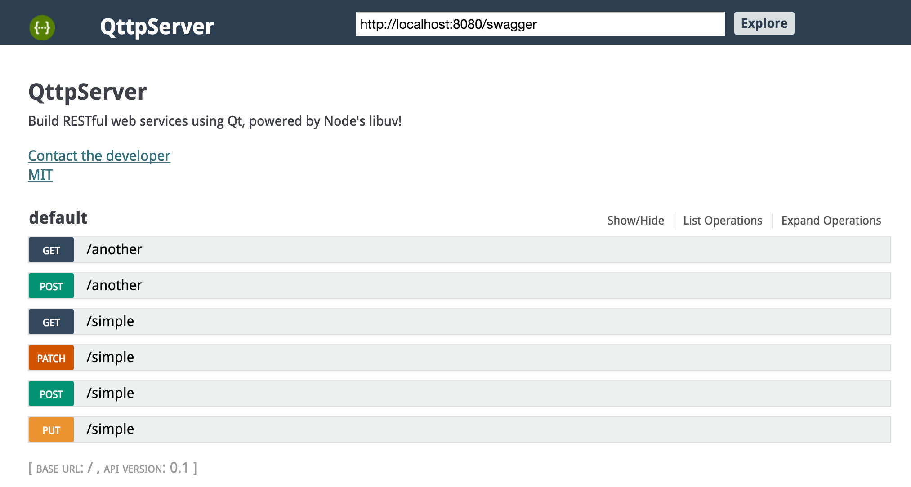

# SwagggerUI - Describe your API



This tutorial assumes a basic understanding of [Actions](./README.md). 

Find the example project for this tutorial [here](./computers/).

## Descriptions

Let's start by defining the mandatory parts of the action, `Laptops`.

``` c++
#include <action.h>

class Laptops : public qttp::Action
{
  public:

    Laptops() : Action(), laptops({
    "macbook", "thinkpad", "chromebook"
  })
    {
    }

    const char* getName() const
    {
      return "laptops-action-name";
    }
```

So now that we have some of the boilerplate code out of the way, let's describe
`Laptops` in greater detail.

``` c++
    const char* getDescription() const
    {
      return "End-point for laptops, yadda yadda yadda";
    }

    const char* getSummary() const
    {
      return "Laptops!";
    }

    QStringList getTags() const
    {
      return { "computers", "laptops" };
    }
```

* `getDescription()` should be the lengthy and verbose text of the Action.  
* `getSummary()` is typically a short sentence, as it only has a single line to fit on the UI.
* `getTags()` are the associated categories/labels given to an Action - this may help declutter a large API set

``` c++
    std::vector<qttp::Input> getInputs() const
    {
      return {
               qttp::Input("model", {{ qttp::HttpMethod::GET, "laptops/:model" },
                                     { qttp::HttpMethod::GET, "laptops/:model/:color" }}),
               qttp::Input("color", {{ qttp::HttpMethod::GET, "laptops/:model/:color" }})
      };
    }

    QList<qttp::HttpPath> getRoutes() const
    {
      return {
               { qttp::HttpMethod::GET, "laptops" },
               { qttp::HttpMethod::GET, "laptops/:model" },
               { qttp::HttpMethod::GET, "laptops/:model/:color" },
               { qttp::HttpMethod::PUT, "laptops" },
      };
    }
```

Now we turn out attention to `std::vector<qttp::Input> getInputs() const`. Here, we're returning a
`qttp::Input` object with the paramter name `"model"` that matches a path defined
within `getRoutes()`. 

## Putting It All Together

*main.cpp:*

``` c++
int main(int argc, char** argv)
{
  QCoreApplication app(argc, argv);
  qttp::HttpServer* httpSvr = qttp::HttpServer::getInstance();
  httpSvr->initialize();
  httpSvr->addActionAndRegister<Laptops>();

  qttp::HttpServer::ServerInfo info = httpSvr->getServerInfo();
  info.title = "Computers API";
  info.description = "An API that lists different types of computers.";
  info.companyName = "Computers";
  httpSvr->setServerInfo(info);
```

After adding and registering the Action, configure QttpServer so that it serves the SwaggerUI
files.

Note: QttpServer will automatically search the current directory for a `./config/` folder for
`global.json` and `routes.json`.  These config files helps make quick adjustments.  Read 
more about it [here](./CONFIG.md).

``` c++
  httpSvr->initHttpDirectory(QDir().absoluteFilePath("./www"));
```

To get going quickly, make a call to `initHttpDirectory()` to point to the folder with SwaggerUI.

The `Laptops` project should already provide a soft-link to the www directory, `QttpServer/www`.
